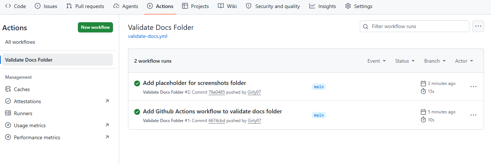

# RaceDay – Event Management System

## Brief Description
RaceDay is a full‑stack web application for managing road running, walking, and cycling events in South Africa. It allows Organisers to create events, manage categories, and publish results; Participants can browse events, enrol, and track their own performance.

## Roles
- **Organiser** – creates and manages events, categories, and results.
- **Participant** – browses events, enrols, and views own results.
  

## CI/CD
GitHub Actions validates the presence of required planning documents in the `/docs` folder.

## Video Presentation
[Watch the walkthrough on YouTube](https://youtu.be/skpsFJt8tBE?si=4aUrEvBs-3HFk_N-)
